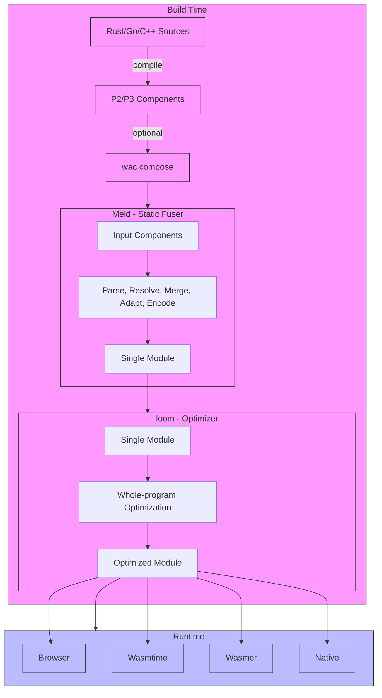

# Meld

**Static WebAssembly Component Fusion**

_"In protocol design, perfection has been reached not when there is nothing left to add, but when there is nothing left to take away." — RFC 1925_

Meld fuses multiple P2/P3 WebAssembly components into a single core module,
eliminating the need for runtime linking.

Part of the **pulseengine toolchain**:
- **[loom](https://github.com/pulseengine/loom)** - Formally verified WebAssembly optimizer
- **meld** - Static component fuser (this tool)

## The Name

The word *meld* means to merge or fuse into a unified whole — from metallurgy,
where metals are melded by heating them together until they become one. This
captures exactly what the tool does: separate WebAssembly components go in,
a single cohesive core module comes out.

In the pulseengine toolchain, each tool carries a short, evocative name:
**loom** weaves optimizations together; **meld** fuses components into one.

## Why Meld?

Today, multiple WebAssembly components can be composed using tools like WAC,
but they still require runtime linking. This prevents:

- Whole-program optimization across component boundaries
- Using tools like loom to optimize the entire component graph
- Direct browser execution without a component runtime
- Efficient native transpilation to embedded targets

Meld solves this by statically linking all components at build time:

```
P2/P3 Components → meld → Single Module → loom optimize → Browser/Native
```

## Installation

### From Source (Cargo)

```bash
cargo install --path meld-cli
```

### From Source (Bazel)

```bash
bazel build //meld-cli:meld
```

### Pre-built Binaries

Coming soon on GitHub Releases.

## Usage

### Basic Fusion

```bash
# Fuse two components
meld fuse component_a.wasm component_b.wasm -o fused.wasm

# Fuse with statistics
meld fuse --stats component_a.wasm component_b.wasm -o fused.wasm

# Inspect a component before fusion
meld inspect component_a.wasm --interfaces
```

### Bazel Integration

```starlark
load("@meld//rules:meld.bzl", "meld_fuse")

# Fuse components built with rules_wasm_component
meld_fuse(
    name = "my_app",
    components = [
        ":component_a",
        ":component_b",
    ],
)
```

### Full Pipeline Example

```bash
# 1. Build components (e.g., with cargo component)
cargo component build --release

# 2. Compose components (optional, if using WAC)
wac compose component_a.wasm component_b.wasm -o composed.wasm

# 3. Fuse into single module
meld fuse composed.wasm -o fused.wasm

# 4. Optimize with loom
loom optimize fused.wasm -o optimized.wasm

# 5. Run in browser or runtime
wasmtime run optimized.wasm
```

## Pipeline Architecture



## Memory Strategies

### Shared Memory (Default)

All components share a single linear memory. This is simpler and allows
the most aggressive optimizations, but requires careful coordination.

```bash
meld fuse --memory shared a.wasm b.wasm -o fused.wasm
```

### Multi-Memory (Experimental)

Each component retains its own linear memory. This provides better isolation
but requires multi-memory support in the target runtime.

```bash
meld fuse --memory multi a.wasm b.wasm -o fused.wasm
```

## Supply Chain Security

Meld integrates with [wsc](https://github.com/pulseengine/wsc) for supply chain
attestation. Each fusion operation records:

- Input component hashes
- Tool version and configuration
- Transformation metadata

The attestation is embedded in the output module's custom section:
`wsc.transformation.attestation`

## How It Works

1. **Parse**: Extract core modules and type information from components
2. **Resolve**: Build import/export graph, identify cross-component calls
3. **Merge**: Combine function/memory/table/global index spaces
4. **Adapt**: Generate Canonical ABI trampolines for cross-component calls
5. **Encode**: Output single core WebAssembly module

### Adapter Generation

Cross-component calls may require adapters that handle:
- String transcoding (UTF-8 ↔ UTF-16, Latin-1 → UTF-8)
- Memory copying between component memories
- List/array serialization
- Resource handle transfer

Meld generates these adapters using techniques inspired by wasmtime's FACT
(Fused Adapter Compiler of Trampolines). When components share a single memory,
cross-component calls are resolved to direct function calls with no adapter
overhead.

## Limitations

- **Phase 1**: Currently uses shared memory strategy only (multi-memory planned)
- **Resources**: Resource handle transfer across components is limited
- **Async**: Async component functions not yet supported
- **Cross-memory adapters**: When components use separate memories, the memory-copy
  adapter generates direct calls (full copy-and-rewrite is planned)
- **String transcoding**: UTF-8↔UTF-16 and Latin-1→UTF-8 are implemented;
  UTF-8→Latin-1 is not yet supported

## Formal Verification

Meld's core transformations are formally verified using Rocq 9.0 (formerly Coq).
The proofs establish that fusion preserves program semantics — the fused module
behaves identically to the original composed components.

**22 proof files, 207 theorems/lemmas, 0 Admitted.**

Key verified properties:
- **Merge correctness**: Index remapping preserves function/memory/table references
- **Resolve correctness**: Topological sort produces valid instantiation order;
  cycle detection terminates
- **Adapter correctness**: Generated trampolines preserve call semantics
- **Forward simulation**: Fused module simulates the original component graph
  step-by-step

Proofs are built via Bazel using [`rules_rocq_rust`](https://github.com/pulseengine/rules_rocq_rust):

```bash
bazel build //proofs/transformations/merge:merge_spec
bazel build //proofs/spec:fusion_spec
```

See [`proofs/`](proofs/) for the full proof tree, [`PROOF_GUIDE.md`](proofs/PROOF_GUIDE.md)
for a beginner-friendly introduction, and [`CLAUDE.md`](CLAUDE.md) for proof engineering guidelines.

## Development

```bash
# Build
cargo build

# Test
cargo test

# Run with debug logging
RUST_LOG=debug cargo run -- fuse a.wasm b.wasm -o out.wasm

# Bazel build
bazel build //...
```

## Related Projects

- [WAC](https://github.com/bytecodealliance/wac) - WebAssembly Composition
- [wit-component](https://github.com/bytecodealliance/wasm-tools) - Component tooling
- [wasmtime](https://github.com/bytecodealliance/wasmtime) - WASM runtime with FACT

## License

Apache-2.0

## Contributing

Contributions welcome! Please read the [contributing guidelines](CONTRIBUTING.md) first.
