# Meld Core Architecture

**Automotive SPICE Compliant Safety Architecture with Formal Verification**

This document explains the safety-critical architecture of Meld's WebAssembly fusion engine, designed to meet automotive industry standards including **Automotive SPICE (ISO/IEC 15504)** and **ISO 26262** functional safety requirements.

## Table of Contents

- [Safety-Critical Overview](#safety-critical-overview)
- [Automotive SPICE Compliance](#automotive-spice-compliance)
- [Logical Decomposition](#logical-decomposition)
- [Deployment Architecture](#deployment-architecture)
- [Dynamic Flow Analysis](#dynamic-flow-analysis)
- [Proof Architecture Linkage](#proof-architecture-linkage)
- [Component Model](#component-model)
- [Core Pipeline](#core-pipeline)
- [Memory Safety](#memory-safety)
- [Error Containment](#error-containment)

## Automotive SPICE Compliance

Meld's architecture is designed to meet **Automotive SPICE (ISO/IEC 15504)** process requirements for safety-critical software development:

```mermaid
flowchart TD
    subgraph SPICEProcesses[Automotive SPICE Process Groups]
        direction TB
        ENG[ENG - Engineering] -->|SWE.1-6| Software
        MAN[MAN - Management] -->|MAN.3| Project Management
        SUP[SUP - Support] -->|SUP.1| Quality Assurance
    end

    subgraph MeldSPICE[Meld SPICE Compliance]
        direction TB
        Req[SWE.1 Requirements] --> Design[SWE.3 Design]
        Design --> Implement[SWE.4 Implementation]
        Implement --> Test[SWE.5 Testing]
        Test --> Integrate[SWE.6 Integration]
    end

    SPICEProcesses -->|maps to| MeldSPICE

    classDef spiceFill fill:#f9f,stroke:#333;
    class ENG,MAN,SUP,Req,Design,Implement,Test,Integrate spiceFill
```

### SPICE Process Mapping

| Automotive SPICE Process | Meld Implementation | Compliance Evidence |
|--------------------------|---------------------|---------------------|
| **SWE.1 Requirements** | Formal specifications | `proofs/spec/fusion_spec.v` |
| **SWE.2 System Requirements** | Component model | `meld-core/src/parser.rs` |
| **SWE.3 Software Design** | Pipeline architecture | `meld-core/ARCHITECTURE.md` |
| **SWE.4 Software Implementation** | Rust modules | `meld-core/src/` |
| **SWE.5 Software Testing** | Unit/integration tests | `meld-core/tests/` |
| **SWE.6 Software Integration** | Fusion pipeline | `meld-core/src/lib.rs` |

## Safety-Critical Overview

Meld follows a **pipeline-based safety architecture** with formal verification at each transformation stage, designed to meet **ISO 26262 ASIL-D** functional safety requirements:

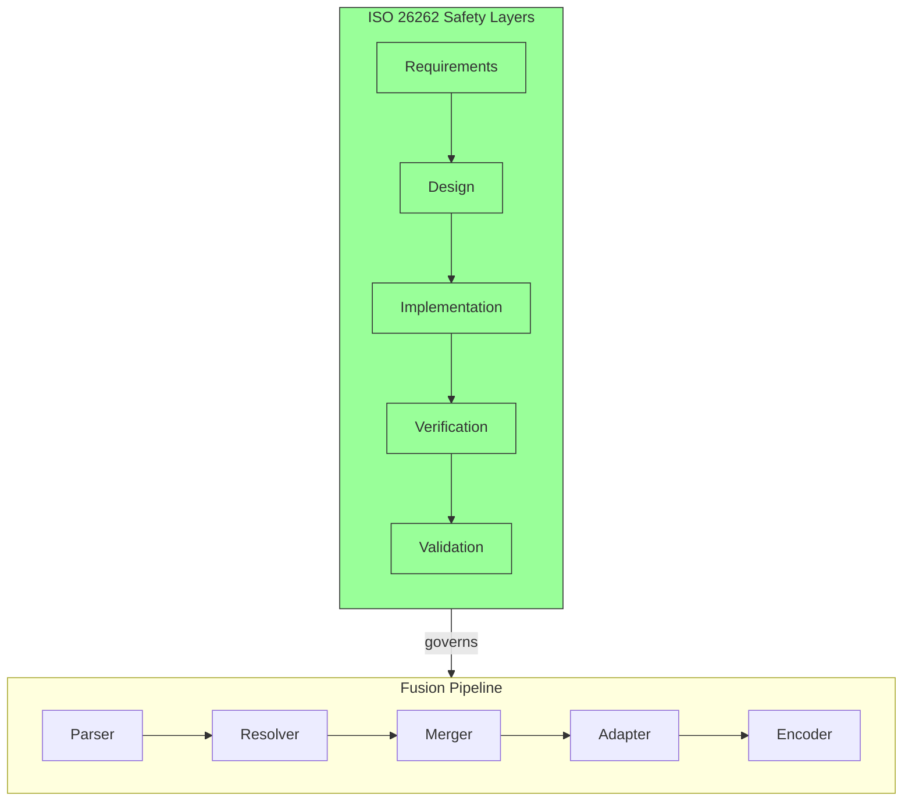

### Safety Principles

1. **Fail-Safe Design**: All errors are detected and fail-fast
2. **Formal Verification**: Mathematical proofs of correctness
3. **Defense-in-Depth**: Multiple validation layers
4. **Deterministic Behavior**: Reproducible fusion results
5. **Memory Safety**: Rust's ownership model + formal proofs

## Overview

Meld is a **static WebAssembly component fuser** that transforms multiple WebAssembly components into a single core module. This eliminates runtime linking overhead and enables whole-program optimization.

### Key Concepts

- **WebAssembly Components**: Standardized modules with imports/exports (W3C specification)
- **Static Fusion**: Build-time linking vs runtime composition
- **Semantic Preservation**: Fused module behaves identically to original components

### Terminology

- **Component**: A WebAssembly module with defined imports and exports
- **Core Module**: The fused output (single `.wasm` file)
- **Adapter**: Generated trampoline code for cross-component calls
- **Dependency Graph**: Component relationships and call dependencies

## Component Model

Meld works with standard WebAssembly components:

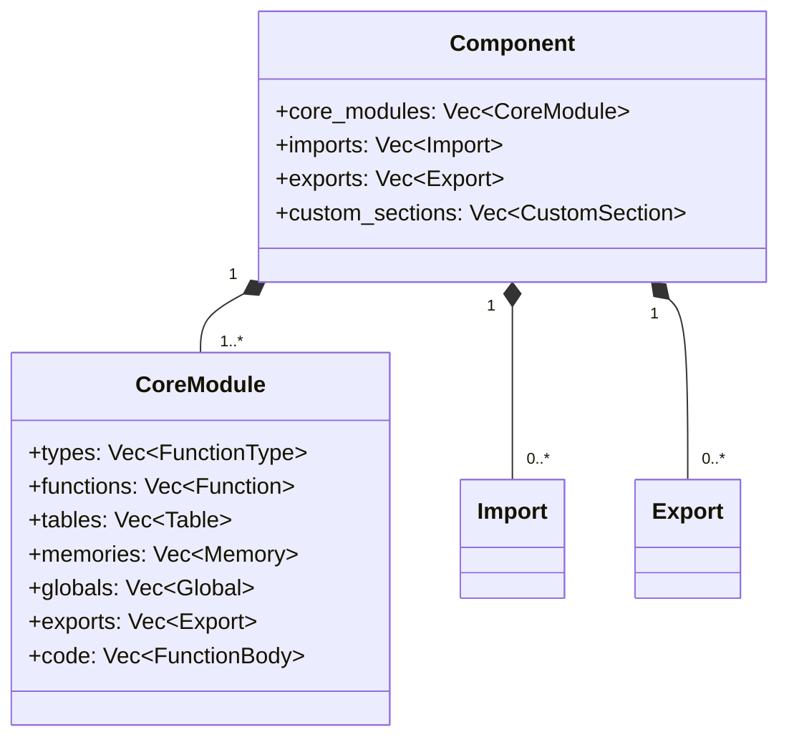

## Architecture Diagram

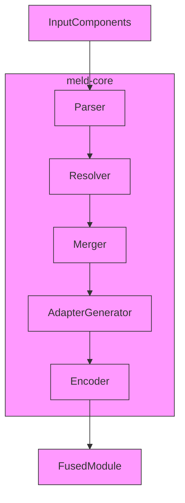

## Data Flow

### 1. Parsing Phase

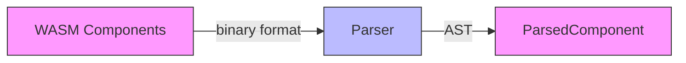

**Input**: WebAssembly binary components
**Output**: Parsed component AST (Abstract Syntax Tree)
**Key Operations**:
- Validate WASM binary format
- Extract type sections, function signatures
- Build import/export mappings
- Preserve custom sections

### 2. Resolution Phase

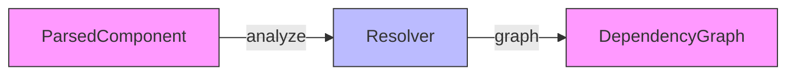

**Input**: Parsed components
**Output**: Dependency graph and resolution plan
**Key Operations**:
- Build component dependency graph
- Topological sorting for instantiation order
- Match imports to exports (intra and inter-component)
- Detect cycles in component dependencies
- Plan memory strategy (shared vs separate)

### 3. Merging Phase


**Input**: Parsed components + dependency graph
**Output**: Merged module with remapped indices
**Key Operations**:
- Merge type sections (deduplicate)
- Merge function signatures
- Merge tables, memories, globals
- Remap function indices (critical for call targets)
- Merge data/element sections
- Build function index mapping table

### 4. Adapter Generation


**Input**: Cross-component call sites
**Output**: Adapter trampoline code
**Key Operations**:
- Generate memory copying adapters (when needed)
- Generate string transcoding adapters
- Generate function dispatch trampolines
- Handle resource handle transfer
- Optimize direct calls (shared memory case)

### 5. Encoding Phase


**Input**: Merged module + adapters
**Output**: Final WebAssembly binary
**Key Operations**:
- Serialize to WASM binary format
- Write type sections
- Write function bodies (with remapped call targets)
- Write adapter trampolines
- Preserve custom sections
- Validate output format

## Core Modules

### `parser.rs`

**Responsibility**: Parse WebAssembly binary format into AST

**Key Components**:
- `parse_component()`: Main entry point
- `parse_type_section()`: Function type parsing
- `parse_function_section()`: Function signature parsing
- `parse_code_section()`: Function body parsing
- `validate()`: WASM validation

### `resolver.rs`

**Responsibility**: Build dependency graph and resolution plan

**Key Components**:
- `build_dependency_graph()`: Component relationship analysis
- `topological_sort()`: Instantiation order planning
- `resolve_imports()`: Import/export matching
- `detect_cycles()`: Cycle detection
- `plan_memory_strategy()`: Memory layout planning

### `merger.rs`

**Responsibility**: Merge components into single module

**Key Components**:
- `merge_components()`: Main fusion logic
- `merge_type_sections()`: Type deduplication
- `remap_function_indices()`: Critical index remapping
- `build_function_index_map()`: Call target resolution
- `merge_data_sections()`: Data segment merging

### `adapter.rs`

**Responsibility**: Generate cross-component call adapters

**Key Components**:
- `generate_memory_adapter()`: Memory copying
- `generate_string_adapter()`: String transcoding
- `generate_dispatch_trampoline()`: Function dispatch
- `optimize_direct_calls()`: Shared memory optimization

### `encoder.rs`

**Responsibility**: Serialize merged module to WASM binary

**Key Components**:
- `encode_module()`: Main serialization
- `write_type_section()`: Type section writing
- `write_function_bodies()`: Code section with remapped calls
- `write_adapter_code()`: Trampoline insertion
- `validate_output()`: Final validation

## Memory Strategies

### Shared Memory (Default)

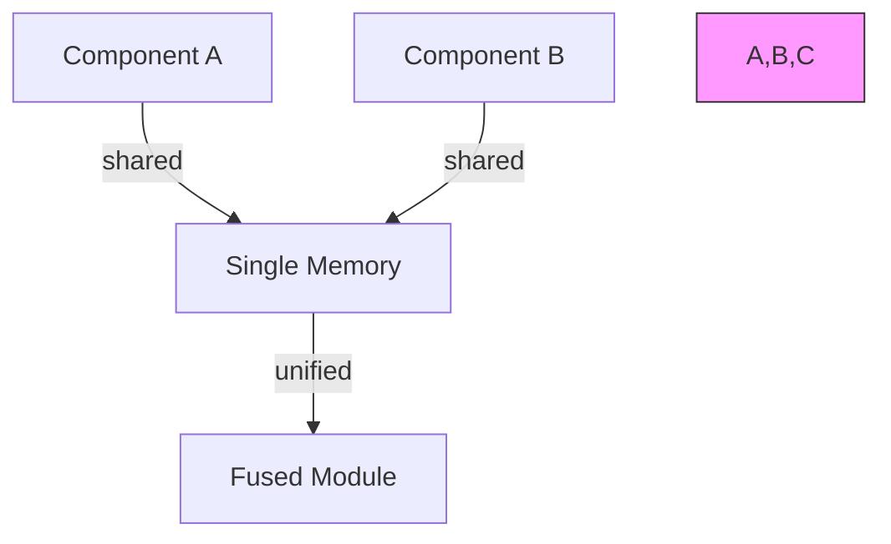

**Characteristics**:
- All components share single linear memory
- Simpler architecture, better optimization
- Direct function calls possible
- Requires careful memory coordination

**Use Case**: Components designed to work together

### Separate Memories (Planned)

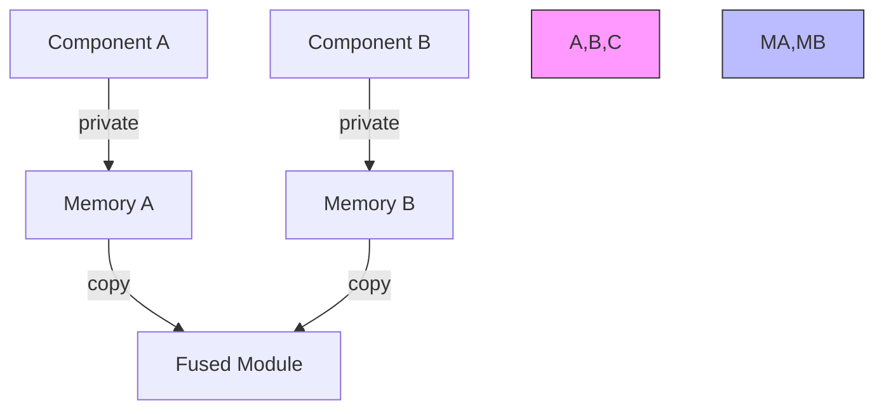

**Characteristics**:
- Each component has private memory
- Requires memory copying adapters
- More complex but safer isolation
- Enables incremental fusion

**Use Case**: Independent components with separate memory needs

## Cross-Component Calls

### Resolution Process

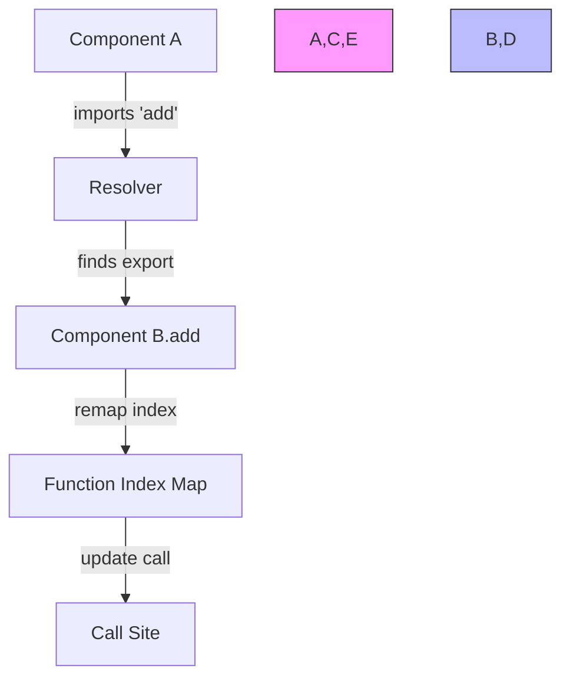

### Adapter Generation

When components use separate memories or need transcoding:

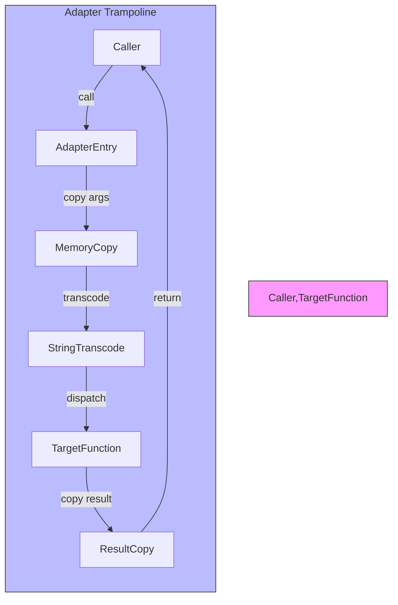

### Direct Call Optimization

When components share memory and no transcoding needed:

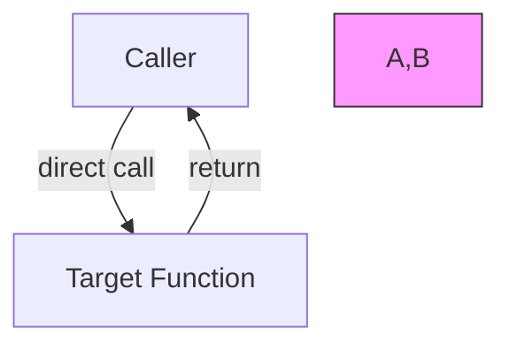

## Error Handling

### Error Types

- **ParseError**: Invalid WASM binary format
- **ResolutionError**: Unresolved imports, cycles detected
- **MergeError**: Index remapping conflicts
- **EncodeError**: Serialization failures
- **ValidationError**: Output validation failures

### Error Handling Strategy

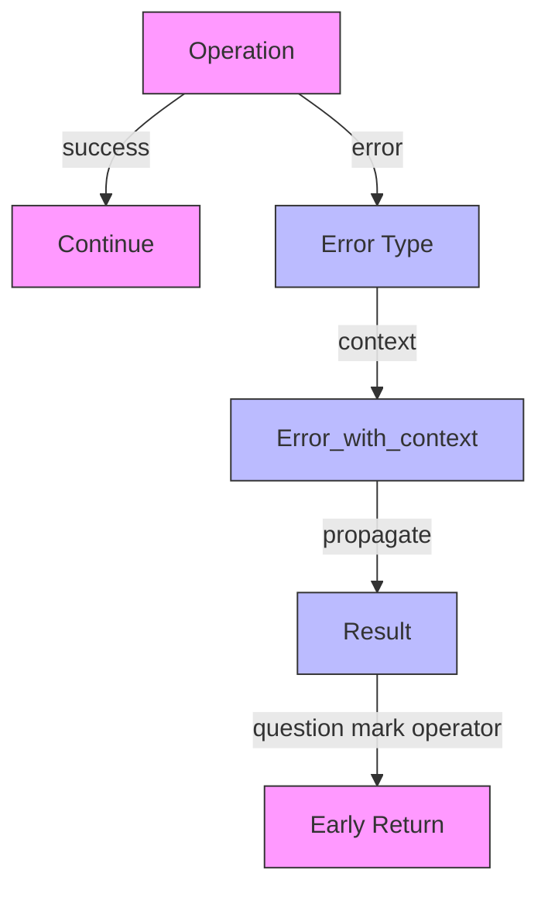

**Key Principles**:
- Use Rust's `Result` type consistently
- Provide contextual error messages
- Fail fast on critical errors
- Validate early, validate often
- Preserve error chains for debugging

## Development Guidelines

### Adding New Features

1. **Parse**: Add parsing support in `parser.rs`
2. **Resolve**: Update dependency analysis in `resolver.rs`
3. **Merge**: Extend merging logic in `merger.rs`
4. **Adapter**: Add adapter generation if needed
5. **Encode**: Update serialization in `encoder.rs`
6. **Test**: Add unit and integration tests

### Performance Considerations

- **Index Remapping**: Critical for call target correctness
- **Memory Layout**: Affects adapter generation efficiency
- **Deduplication**: Type section merging optimizations
- **Parallel Processing**: Component parsing can be parallelized

### Testing Strategy

- **Unit Tests**: Individual module functionality
- **Integration Tests**: End-to-end fusion pipeline
- **Property Tests**: Semantic preservation verification
- **Fuzz Testing**: Robustness against malformed input

## Future Work

- **Multi-Memory Support**: Full separate memory implementation
- **Async Components**: Async function support
- **Resource Handling**: Complete resource type support
- **Incremental Fusion**: Additive component fusion
- **WASM 2.0 Features**: GC, component model extensions

## Related Documents

- [PROOF_GUIDE.md](../proofs/PROOF_GUIDE.md) - Formal verification guide
- [CLAUDE.md](../CLAUDE.md) - Proof engineering guidelines
- [WebAssembly Specification](https://webassembly.github.io/spec/) - Official spec
- [Component Model](https://github.com/WebAssembly/component-model) - W3C proposal
