# Meld Core Architecture - What It Actually Does

This document explains Meld's architecture in **clear, practical terms** - focusing on what it does, how it works, and why it's designed this way.

## Quick Overview

Meld takes multiple WebAssembly components and fuses them into a single core module:

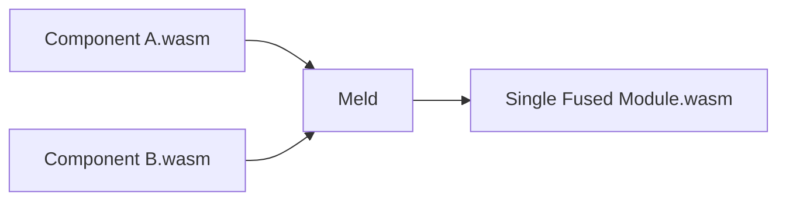

**Why this matters:**
- Eliminates runtime linking overhead
- Enables whole-program optimization
- Preserves original component behavior
- Produces single deployable module

## The 5-Stage Fusion Pipeline

Meld processes components through a clear pipeline:

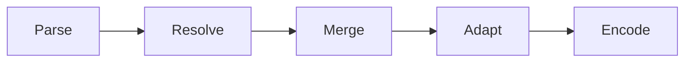

### Stage 1: Parse - Read WebAssembly Components

**What happens:** Converts WASM binary files into structured data

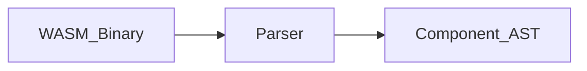

**Details:**
- Validates WASM binary format
- Extracts types, functions, memories
- Builds import/export mappings
- Preserves custom sections

### Stage 2: Resolve - Build Dependency Graph

**What happens:** Figures out who calls whom and in what order

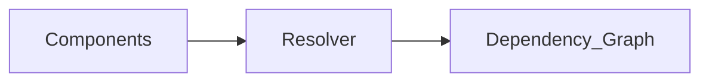

**Details:**
- Matches imports to exports
- Topological sorting (who depends on whom)
- Detects dependency cycles
- Plans memory strategy

### Stage 3: Merge - Combine Components

**What happens:** Fuses multiple components into one module

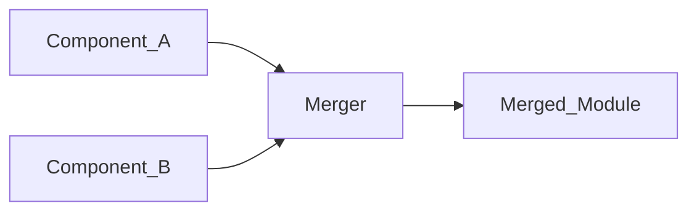

**Critical operation:** Index remapping (updating call targets)

### Stage 4: Adapt - Generate Cross-Component Call Code

**What happens:** Creates trampolines for cross-component calls

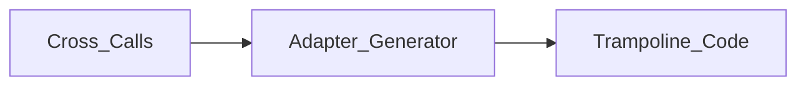

**When needed:**
- Memory copying (separate memories)
- String transcoding
- Function dispatch

**Optimization:** Direct calls when components share memory

### Stage 5: Encode - Write Final WASM

**What happens:** Serializes fused module to WebAssembly binary

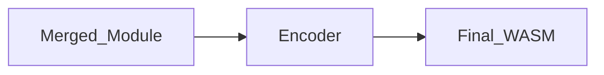

## Component Model

Meld works with standard WebAssembly components:

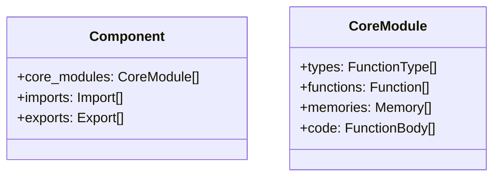

## Memory Strategies

### Shared Memory (Current)

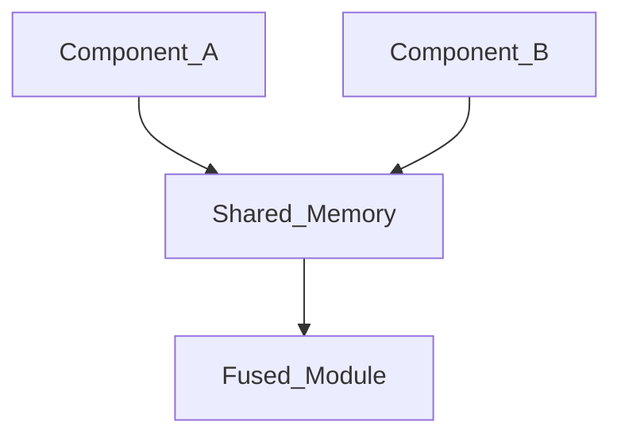

**Pros:** Simpler, direct calls, better optimization
**Cons:** Requires memory coordination

### Separate Memories (Planned)

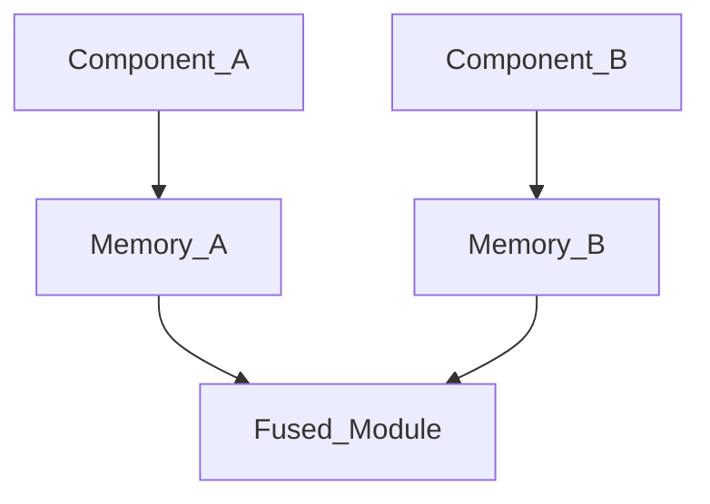

**Pros:** Better isolation
**Cons:** Requires adapters

## Cross-Component Calls

### How Resolution Works

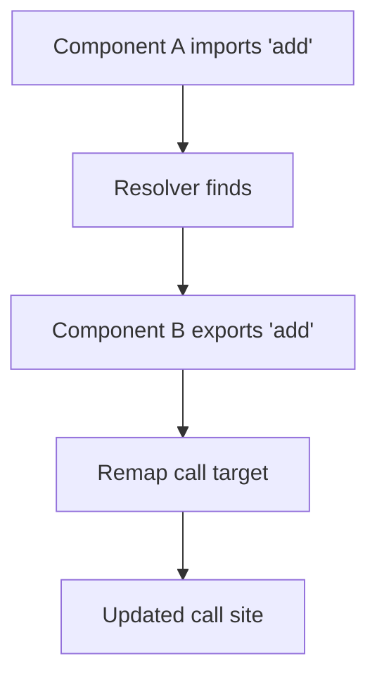

### Direct vs Adapter Calls

**Direct (shared memory):**
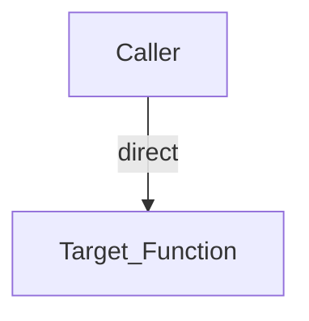

**Adapter (separate memory):**
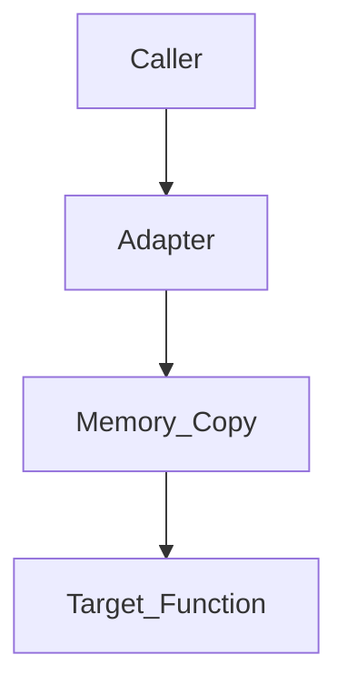

## Error Handling

**Strategy:** Fail-fast with clear error messages

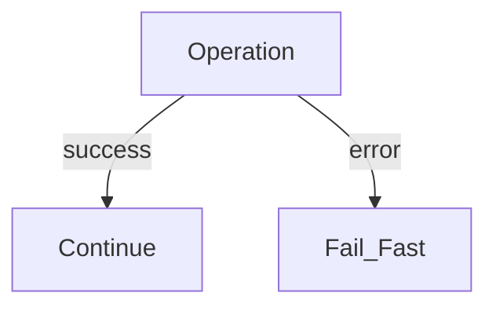

**Error types:** Parse, Resolution, Merge, Encode

## Connection to Formal Proofs

Each stage has corresponding formal verification:

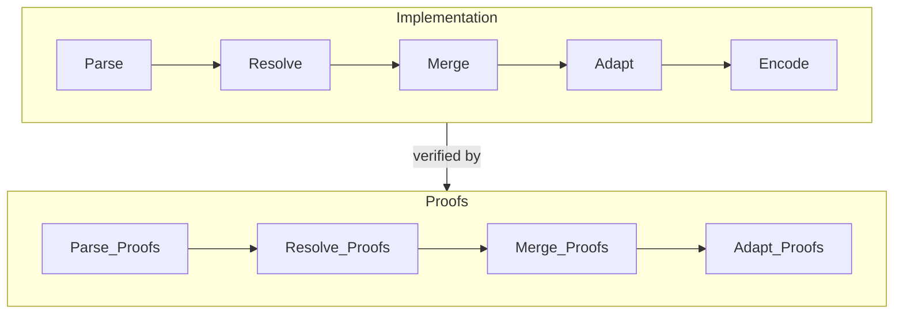

**What's proven:**
- Parse: Input validation correctness
- Resolve: Dependency graph correctness
- Merge: Index remapping safety
- Adapt: Call semantics preservation

## Key Design Principles

1. **Deterministic:** Same inputs → same output
2. **Fail-fast:** Errors detected immediately
3. **Memory safe:** Rust + formal proofs
4. **Semantic preservation:** Fused module behaves like original
5. **Modular:** Clear separation between stages

## Practical Example

Fusing two components where A calls B:

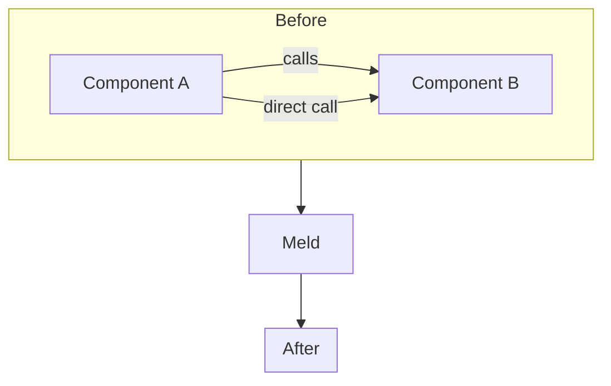

**Result:** Single module with direct function calls, no runtime overhead.

## When to Use Meld

✅ **Good for:** Components designed to work together
✅ **Good for:** Performance-critical applications
✅ **Good for:** Whole-program optimization
❌ **Not for:** Dynamic component loading
❌ **Not for:** Runtime flexibility needs

## Summary

Meld is a **static component fuser** that:
1. Parses WebAssembly components
2. Resolves dependencies
3. Merges components into one
4. Generates adapters if needed
5. Encodes final WASM module

**Key benefit:** Runtime linking overhead eliminated through build-time fusion.
