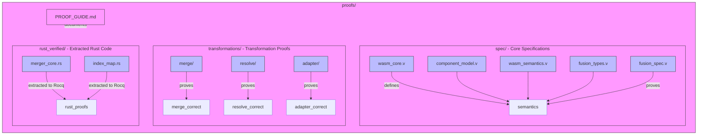
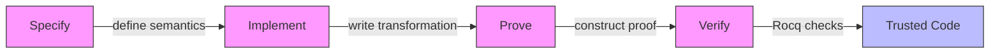
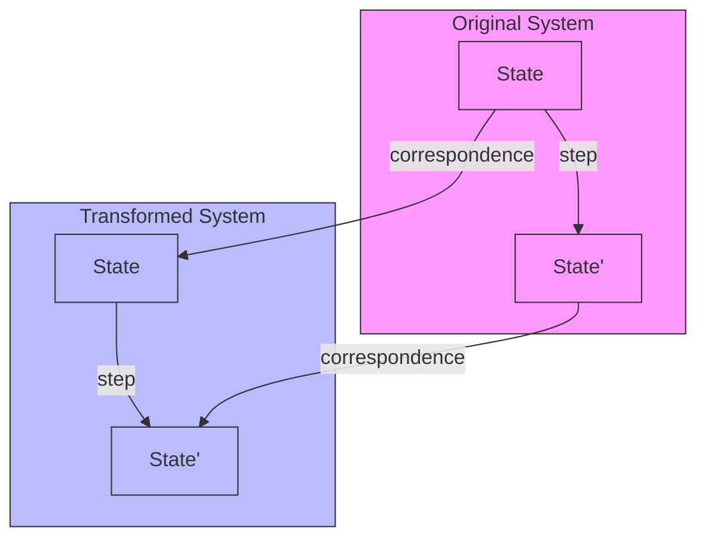

# Meld Formal Verification Guide

A beginner-friendly introduction to Meld's Rocq proofs for developers with computer science background.

## Table of Contents

1. [Introduction to Formal Verification](#introduction-to-formal-verification)
2. [Rocq 9.0 Basics](#rocq-90-basics)
3. [Meld's Proof Architecture](#melds-proof-architecture)
4. [Understanding the Proofs](#understanding-the-proofs)
5. [Key Theorems Explained](#key-theorems-explained)
6. [Proof Patterns and Techniques](#proof-patterns-and-techniques)
7. [Building and Verifying Proofs](#building-and-verifying-proofs)
8. [Contributing to Proofs](#contributing-to-proofs)
9. [Learning Resources](#learning-resources)

## Introduction to Formal Verification

### What is Formal Verification?

Formal verification uses mathematical proofs to demonstrate that software behaves correctly according to its specification. For Meld, this means proving that:

- **Fusion preserves semantics**: The fused module behaves identically to the original composed components
- **Transformations are correct**: Each step (merging, resolving, adapter generation) maintains program correctness
- **Edge cases are handled**: Memory references, function calls, and traps work as expected

### Why Verify Meld?

WebAssembly component fusion is complex:
- Multiple components with different memories and functions
- Cross-component calls requiring adapters
- Index remapping that must preserve references
- Topological sorting for dependency resolution

Formal verification gives us **mathematical certainty** that fusion works correctly in all cases.

### Verification vs. Testing

| Aspect | Testing | Formal Verification |
|--------|---------|---------------------|
| Coverage | Limited to test cases | All possible cases |
| Certainty | High confidence | Mathematical proof |
| Complexity | Handles simple cases well | Essential for complex systems |
| Maintenance | Easy to add tests | Requires proof expertise |

## Rocq 9.0 Basics

### What is Rocq?

Rocq (formerly Coq) is an interactive theorem prover that allows you to:
- Define mathematical objects and properties
- State theorems about these objects
- Construct formal proofs of these theorems
- Extract certified programs from proofs

### Rocq 9.0 vs. Coq 8.x

Meld uses Rocq 9.0, which has several improvements:

1. **Modernized imports**: `From Stdlib Require Import ...` instead of `From Coq Require Import ...`
2. **Better automation**: Enhanced `lia` tactic for linear arithmetic
3. **Improved performance**: Faster proof checking
4. **Better error messages**: More helpful feedback

### Basic Rocq Concepts

```rocq
(* This is a comment in Rocq *)

(* Inductive definition - like an enum in Rust *)
Inductive bool : Type :=
  | true : bool
  | false : bool.

(* Function definition *)
Definition negb (b : bool) : bool :=
  match b with
  | true => false
  | false => true
  end.

(* Theorem statement *)
Theorem negb_involutive : forall b : bool, negb (negb b) = b.
Proof.
  (* Proof goes here *)
  intros b. destruct b. reflexivity. reflexivity.
Qed.
```

**What This Example Shows:**

This simple example illustrates the fundamental structure of Rocq developments:

1. **Comments** (`(* ... *)`): Explain the code, just like `//` in Rust
2. **Inductive Types** (`Inductive`): Define data structures with constructors (like `enum` in Rust)
3. **Definitions** (`Definition`): Create named computations (like `fn` in Rust)
4. **Theorems** (`Theorem`): State properties we want to prove about our definitions
5. **Proofs** (`Proof...Qed`): Construct step-by-step mathematical evidence

**Line-by-Line Explanation:**

```rocq
(* Define a boolean type with two values: true and false *)
Inductive bool : Type :=
  | true : bool    (* true constructs a boolean value *)
  | false : bool.  (* false constructs a boolean value *)

(* Define a function that negates a boolean value *)
Definition negb (b : bool) : bool :=
  match b with          (* Pattern match on the input value *)
  | true => false       (* When input is true, output false *)
  | false => true.      (* When input is false, output true *)

(* State a theorem: negating twice returns the original value *)
Theorem negb_involutive : forall b : bool, negb (negb b) = b.

(* Construct the proof step-by-step *)
Proof.
  intros b.                     (* Assume b is some boolean value *)
  destruct b.                   (* Consider both cases: b is true or false *)
  - reflexivity.               (* Case 1: b=true, negb (negb true) = true by definition *)
  - reflexivity.               (* Case 2: b=false, negb (negb false) = false by definition *)
Qed.                           (* Proof complete! *)
```

**Key Rocq Concepts:**

- `Inductive`: Defines a new data type (like `enum` in Rust)
- `Definition`: Creates a named function/computation
- `Theorem`: States a property to prove about your definitions
- `Proof...Qed`: The proof construction environment
- `intros`: Moves hypotheses into the proof context
- `destruct`: Performs case analysis on inductive types
- `reflexivity`: Proves equality when both sides are identical by definition

### Common Tactics Used in Meld Proofs

| Tactic | Purpose | Example |
|--------|---------|---------|
| `intros` | Move hypotheses to context | `intros H1 H2.` |
| `split` | Break conjunction into subgoals | `split.` |
| `split_all` | Meld's custom tactic for Rocq 9.0 compatibility | `split_all.` |
| `exact` | Apply exact hypothesis | `exact H1.` |
| `rewrite` | Rewrite using equality | `rewrite H2.` |
| `auto` | Automatic proof search | `auto.` |
| `eauto` | Extended auto with hints | `eauto.` |
| `firstorder` | First-order logic | `firstorder.` |
| `tauto` | Intuitionistic tautology | `tauto.` |
| `lia` | Linear arithmetic (Rocq 9.0) | `lia.` |
| `injection` | Injectivity reasoning | `injection H as H1.` |
| `destruct` | Case analysis | `destruct b as [Htrue | Hfalse].` |
| `apply` | Apply lemma/theorem | `apply function_call_correspondence.` |
| `reflexivity` | Prove equality by reflexivity | `reflexivity.` |

**For more on tactics:** See [Coq Tactics Reference](https://coq.inria.fr/refman/proof-engine/tactics.html) and [Software Foundations](https://softwarefoundations.cis.upenn.edu/lf-current/Tactics.html)

## Meld's Proof Architecture

### Proof Structure Overview

Meld's proofs mirror the Rust implementation structure:



**Directory Structure:**
- `spec/`: Core specifications and semantics (WebAssembly model, component model, fusion semantics)
- `transformations/`: Transformation-specific proofs (merge correctness, resolve correctness, adapter correctness)
- `rust_verified/`: Rust code extracted to Rocq using `rocq-of-rust` for verification
- `PROOF_GUIDE.md`: This documentation guide

### The Proof Pipeline



1. **Specify**: Define what correct behavior means (semantics)
2. **Implement**: Write the transformation in Rocq (or extract from Rust)
3. **Prove**: Show the implementation meets the specification
4. **Verify**: Use Rocq to check all proofs are valid

### How Proofs Relate to Rust Code

Meld uses a hybrid approach:
- **Rust implementation**: The actual fusion engine (`meld-core/`)
- **Rocq specification**: Formal definition of correct behavior
- **Proof connection**: Some Rust code is extracted to Rocq for verification

The `rust_verified/` directory contains Rust code that has been translated to Rocq using `rocq-of-rust`.

## Understanding the Proofs

### Reading a Theorem Statement

Let's break down a typical theorem from Meld:

```rocq
Theorem fusion_preserves_semantics :
  forall (cc : ComponentCollection) (fr : FunctionRemapping) (ces : ComponentExecutionState),
  forall (fes : FusedExecutionState) (ms : MemoryState),
  component_collection_corresponds cc fr ces fes ms ->
  result_state_corresponds cc fr ces fes ms ->
  (component_collection_step cc ces = Some (cc', ces')) ->
  (fused_module_step (fused_module cc fr) fes = Some fes') ->
  component_collection_corresponds cc' fr ces' fes' ms.
```

This theorem states:
- **For all** component collections `cc`, function remappings `fr`, etc.
- **If** the component collection and fused module correspond (`component_collection_corresponds`)
- **And if** the result states correspond (`result_state_corresponds`)
- **And if** the component collection can take a step to `cc', ces'`
- **And if** the fused module can take a step to `fes'`
- **Then** the new states also correspond

In plain English: "If the component collection and fused module start in corresponding states and both can execute one step, their resulting states will also correspond."

### Proof Structure Example

```rocq
Proof.
  intros cc fr ces fes ms Hcorr Hresult Hcc_step Hfused_step.
  (* Destruct the component collection step *)
  destruct Hcc_step as [cc' ces' Hcc_step_eq].
  (* Destruct the fused module step *)
  destruct Hfused_step as [fes' Hfused_step_eq].
  (* Case analysis on the component collection step *)
  destruct (component_collection_step cc ces) eqn:Hstep; try congruence.
  (* Handle each case of component execution *)
  - (* Function call case *)
    destruct Hstep as [fr' ces'' Hfr' Hces''].
    (* Use the function call correspondence lemma *)
    apply function_call_correspondence with (fr := fr').
    + exact Hcorr.
    + exact Hresult.
    + exact Hfr'.
    + exact Hces''.
    + exact Hcc_step_eq.
    + exact Hfused_step_eq.
  - (* Memory operation case *)
    (* Similar structure for memory operations *)
    ...
Qed.
```

### Common Proof Patterns

1. **Forward Simulation**: Show that each step of the original system corresponds to a step in the transformed system
2. **Injectivity Proofs**: Show that mappings preserve uniqueness
3. **Trap Equivalence**: Show that errors occur in the same situations
4. **Index Remapping**: Show that function/memory references are correctly updated

### Deep Dive: Tactics in Action

Let's examine how tactics are used in real Meld proofs:

#### Example 1: Using `split_all` (from `fusion_spec.v`)

```rocq
(* Before Rocq 9.0, we used 'repeat split' *)
unfold result_state_corresponds. repeat split.

(* After Rocq 9.0, we use 'split_all' to handle nested conjunctions *)
unfold result_state_corresponds. split_all.
```

The `split_all` tactic recursively breaks down all conjunctions (`/\`) into separate subgoals.

#### Example 2: Case Analysis with `destruct`

```rocq
(* From merge_correctness.v - analyzing WebAssembly operations *)
destruct op; try (solve_by_invert; congruence).
- (* i32.add case *)
  apply i32_add_correct. auto.
- (* i32.sub case *)
  apply i32_sub_correct. auto.
- (* call case *)
  apply call_correct. eauto.
```

#### Example 3: Equality Reasoning with `rewrite` and `reflexivity`

```rocq
(* From wasm_semantics.v - proving set_stack preserves locals *)
Lemma set_stack_locals : forall ms s, ms_locals (set_stack ms s) = ms_locals ms.
Proof.
  intros ms s.  (* Move variables to context *)
  reflexivity.  (* Prove by definition - both sides are equal by definition *)
Qed.
```

#### Example 4: Using `injection` for Injectivity

```rocq
(* From merge_layout.v - proving function index mapping is injective *)
Lemma function_index_injective :
  forall f1 f2, function_index f1 = function_index f2 -> f1 = f2.
Proof.
  intros f1 f2 H.  (* H is the equality hypothesis *)
  injection H as H1.  (* Extract injectivity information *)
  subst.  (* Substitute using the equality *)
  reflexivity.  (* Conclusion is now trivial *)
Qed.
```

#### Example 5: Combining Tactics in Complex Proofs

```rocq
(* From fusion_spec.v - typical proof structure *)
Proof.
  intros cc fr ces fes ms Hcorr Hresult Hcc_step Hfused_step.
  (* Setup: destruct hypotheses to get concrete values *)
  destruct Hcc_step as [cc' ces' Hcc_step_eq].
  destruct Hfused_step as [fes' Hfused_step_eq].

  (* Case analysis on the operation type *)
  destruct (component_collection_step cc ces) eqn:Hstep; try congruence.

  (* Handle function call case *)
  - destruct Hstep as [fr' ces'' Hfr' Hces''].
    apply function_call_correspondence with (fr := fr').
    + exact Hcorr.    (* Use correspondence hypothesis *)
    + exact Hresult.   (* Use result state hypothesis *)
    + exact Hfr'.      (* Use function remapping *)
    + exact Hces''.    (* Use component execution state *)
    + exact Hcc_step_eq. (* Use step equality *)
    + exact Hfused_step_eq. (* Use fused step equality *)

  (* Handle other cases similarly... *)
  - (* memory.load case *) ...
  - (* global.get case *) ...
Qed.
```

**Key Insights:**
- `intros` moves all hypotheses into the proof context
- `destruct` breaks down complex data structures and hypotheses
- `apply` uses existing lemmas to solve subgoals
- `exact` provides the exact hypothesis needed
- `auto` and `eauto` handle routine cases automatically
- The `+` bullets handle subgoals created by `apply`

**Learning Resources for Tactics:**
- [Coq Tactics Reference](https://coq.inria.fr/refman/proof-engine/tactics.html) - Official documentation
- [Software Foundations: Tactics](https://softwarefoundations.cis.upenn.edu/lf-current/Tactics.html) - Interactive tutorial
- [Coq Art](https://xavierleroy.org/coqart/) - Advanced tactics and automation
- [Certified Programming with Dependent Types](http://adam.chlipala.net/cpdt/) - Advanced proof techniques

## Key Theorems Explained

### 1. Fusion Preserves Semantics (`fusion_preserves_semantics`)

**What it proves**: The fused module behaves identically to the original component collection.

**Why it matters**: This is the core correctness property - fusion doesn't change program behavior.

**Proof approach**: Forward simulation showing each component collection step corresponds to a fused module step.

### 2. Generate Adapters Correct (`generate_adapters_correct`)

**What it proves**: The adapter generation process produces correct trampolines for cross-component calls.

**Why it matters**: Adapters handle memory copying, string transcoding, and function dispatch.

**Proof approach**: Show that generated adapters preserve call semantics and handle all edge cases.

### 3. Fusion Forward Simulation (`fusion_forward_simulation`)

**What it proves**: The fused module can simulate the component collection step-by-step.

**Why it matters**: Ensures that fusion doesn't introduce new behaviors or remove existing ones.

**Proof approach**: Structural induction over execution traces with case analysis on each operation type.

### 4. Fusion Trap Equivalence (`fusion_trap_equivalence`)

**What it proves**: The fused module traps (errors) in exactly the same situations as the component collection.

**Why it matters**: Fusion shouldn't mask errors or introduce new ones.

**Proof approach**: Case analysis on all trapping operations with correspondence proofs.

## Proof Patterns and Techniques

### Forward Simulation Pattern

Forward simulation is the primary technique used in Meld's proofs:



The proof shows that:
1. If original and transformed states correspond
2. And the original can take a step
3. Then the transformed can take a corresponding step
4. And the new states will correspond

### Injectivity Proofs

Injectivity proofs show that mappings preserve uniqueness:

```rocq
Lemma function_index_injective :
  forall f1 f2, function_index f1 = function_index f2 -> f1 = f2.
Proof.
  intros f1 f2 H. injection H as H1. subst. reflexivity.
Qed.
```

### Case Analysis

Most proofs use extensive case analysis on WebAssembly operations:

```rocq
induction op; try (solve_by_invert; congruence).
- (* i32.add case *) ...
- (* i32.sub case *) ...
- (* call case *) ...
- (* memory.load case *) ...
```

### Correspondence Relations

Correspondence relations define what it means for two states to be equivalent:

```rocq
Definition state_corresponds (s1 : OriginalState) (s2 : TransformedState) : Prop :=
  value_stacks_equal s1 s2 /
  memories_equal s1 s2 /
  functions_equal s1 s2 /
  globals_equal s1 s2.
```

## Building and Verifying Proofs

### Prerequisites

1. **Nix**: Required for Rocq environment management
2. **Bazel**: Build system for proof verification
3. **Rust**: For the main Meld implementation

### Building Proofs

```bash
# Build all merge proofs
bazel build //proofs/transformations/merge:merge_spec

# Build fusion specification proofs
bazel build //proofs/spec:fusion_spec

# Build all proofs
bazel build //proofs/...
```

### Proof Development Workflow

1. **Edit proof files**: Modify `.v` files in the `proofs/` directory
2. **Test locally**: Use `coqtop` or `coqide` for interactive development
3. **Build with Bazel**: Verify proofs compile with the full build system
4. **Run CI**: Ensure all proofs pass in the continuous integration system

### Common Build Issues

- **Missing dependencies**: Ensure Nix shell has all required packages
- **Tactic failures**: Rocq 9.0 changed some tactic behaviors (see `split_all` in fusion_spec.v)
- **Performance**: Large proofs may take significant time to verify

## Contributing to Proofs

### Getting Started

1. **Learn Rocq basics**: Work through "Software Foundations" (recommended below)
2. **Understand the domain**: Study WebAssembly semantics and component model
3. **Read existing proofs**: Start with simpler proofs in `transformations/merge/`
4. **Make small changes**: Add lemmas, improve automation, fix tactic issues

### Proof Style Guide

1. **Use meaningful names**: `Hcorr` for correspondence hypotheses, `Hstep` for step hypotheses
2. **Add comments**: Explain the proof strategy at each major step
3. **Prefer automation**: Use `auto`, `eauto`, `lia` where possible
4. **Keep proofs maintainable**: Avoid overly complex tactic sequences
5. **Document assumptions**: Clearly state what each lemma assumes

### Adding New Proofs

1. **Identify the property**: What needs to be proven?
2. **State the theorem**: Write the formal statement in Rocq
3. **Develop the proof**: Start with `admit.` and refine incrementally
4. **Test locally**: Verify with `coqtop` or `coqide`
5. **Integrate**: Add to the appropriate Bazel build target

## Learning Resources

### Rocq/Coq Tutorials

1. **[Software Foundations](https://softwarefoundations.cis.upenn.edu/)** (Highly recommended!)
   - Volume 1: Logical Foundations
   - Volume 2: Programming Language Foundations
   - Volume 3: Verified Functional Algorithms

2. **[Coq in a Hurry](https://cel.archives-ouvertes.fr/inria-00001173/document)**
   - Quick introduction to Coq (applies to Rocq 9.0)

3. **[Certified Programming with Dependent Types](http://adam.chlipala.net/cpdt/)**
   - Advanced techniques for program verification

### WebAssembly Resources

1. **[WebAssembly Specification](https://webassembly.github.io/spec/)**
   - Official specification (matches Meld's formal model)

2. **[WebAssembly Component Model](https://github.com/WebAssembly/component-model)**
   - Component model specification

### Meld-Specific Resources

1. **[Meld README](../README.md)**
   - Overview of Meld's architecture and goals

2. **[Proof Decisions](DECISIONS.md)**
   - Design decisions and trade-offs in the proof structure

3. **[Rust Implementation](../../meld-core/)**
   - The actual fusion engine being verified

## Glossary

**Admitted**: A theorem marked as true without proof (Meld has 0 of these!)

**Correspondence**: A relation showing two states are equivalent

**Forward Simulation**: Proof technique showing step-by-step equivalence

**Injective**: A function that preserves uniqueness (no collisions)

**Qed**: Marks the end of a completed proof

**Tactic**: A command that transforms the proof state

**Theorem**: A statement to be proven

**Lemma**: A helper theorem used in larger proofs

## Next Steps

1. **Read the main fusion proof**: Start with `spec/fusion_spec.v`
2. **Examine simple lemmas**: Look at `transformations/merge/merge_layout.v`
3. **Try building proofs**: Run `bazel build //proofs/spec:fusion_spec`
4. **Ask questions**: The proof engineering community is welcoming to beginners!

Remember: Formal verification is a journey. Start small, ask questions, and gradually build your understanding. Every expert was once a beginner!
