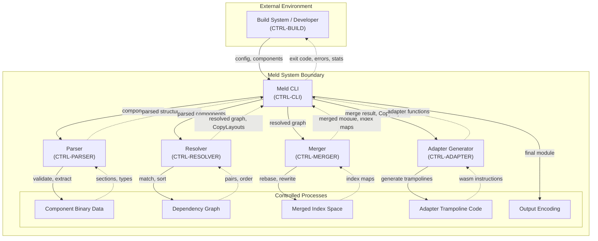
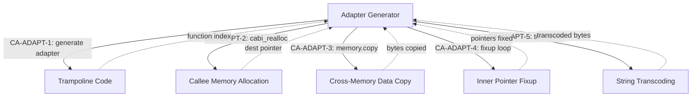

# Meld STPA Control Structure Diagram

## High-Level Control Structure

## Adapter Generator Detail (CTRL-ADAPTER)

## Legend

- **Solid arrows** (-->) = Control actions (commands flowing downward)
- **Dashed arrows** (-..->) = Feedback (information flowing upward)
- Each controller has a process model (internal beliefs) used to make decisions
- STPA does not assume obedience: control actions may not be executed correctly
